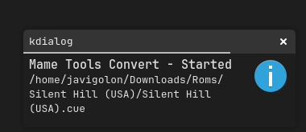

# MAME Tools Plugin for Dolphin File Manager

A plugin for the Dolphin File Manager to easily access and use MAME Tools.

## Requirements:
* You must have the `mame-tools` package installed for this plugin to function correctly.

## Installation:
1. Clone this repository.
   ```
   git clone https://github.com/javigolon/dolphin-mametools-plugin.git
   cd dolphin-mametools-plugin
   ```
2. Ensure that the `MAME Tools.desktop` file is executable.
3. Copy or Move the `MAME Tools.desktop` file to `~/.local/share/kio/servicemenus/`.

## Usage:
1. Right-click on your file.


* The `Convert` option converts your ROM file(s) into the `.chd` format.
* The `Convert and delete the original file` option converts your ROM file(s) and then deletes the original `.iso` or `.cue` file.

2. A pop-up notification will appear indicating that the conversion process has started.



3. A second pop-up notification will confirm that the conversion process is finished.


## Features:
* Supports both `.iso` and `.cue` files.
* Allows processing of multiple files simultaneously (though this is not recommended).

## Notes:
* When using the `Convert and delete the original file` option on `.cue` files, the corresponding `.bin` files are currently not deleted. (Might fix it later.)
* The process will be canceled if a `.chd` file with an identical name is detected.
* **BE CAREFUL** with converting multiple files at once.

## Thanks:
* KDE Team
* MAME Development Team
